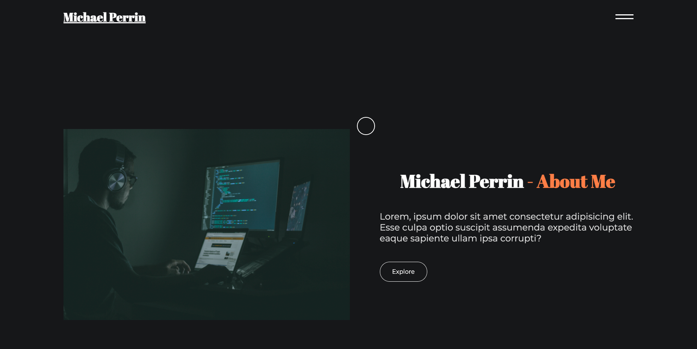
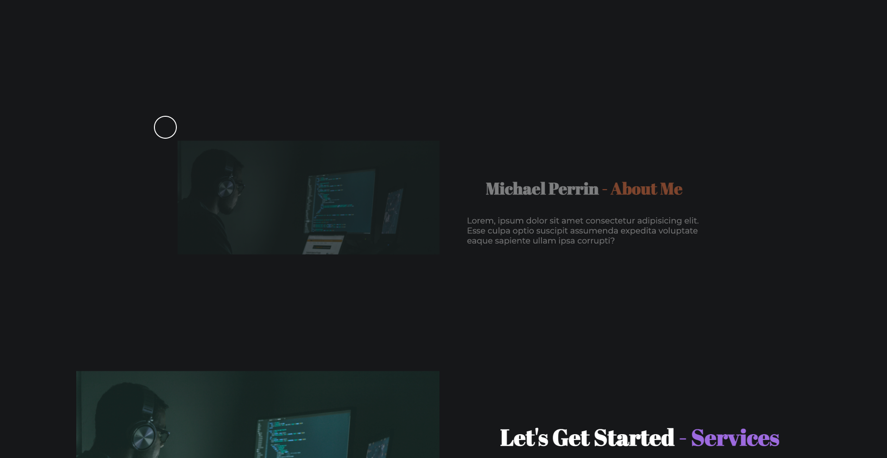
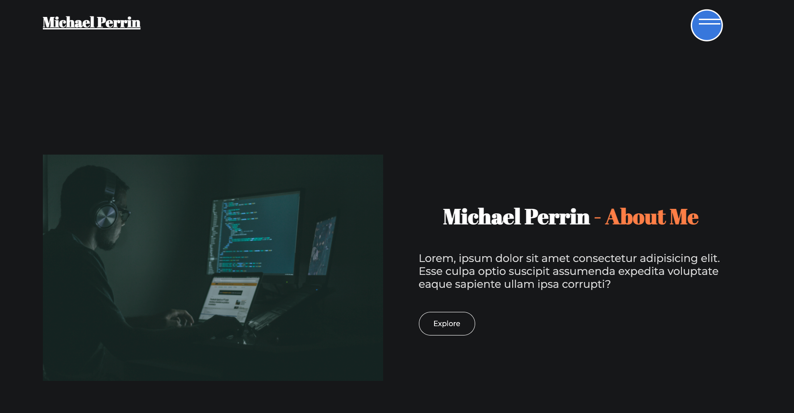
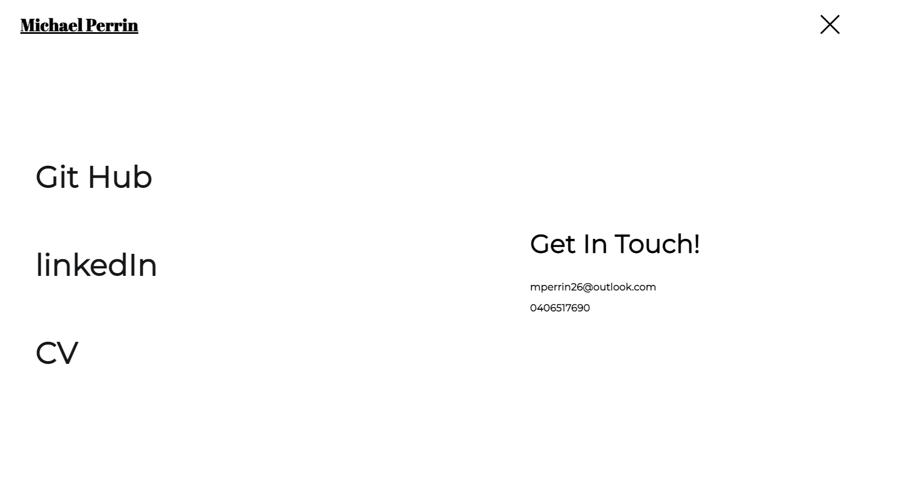
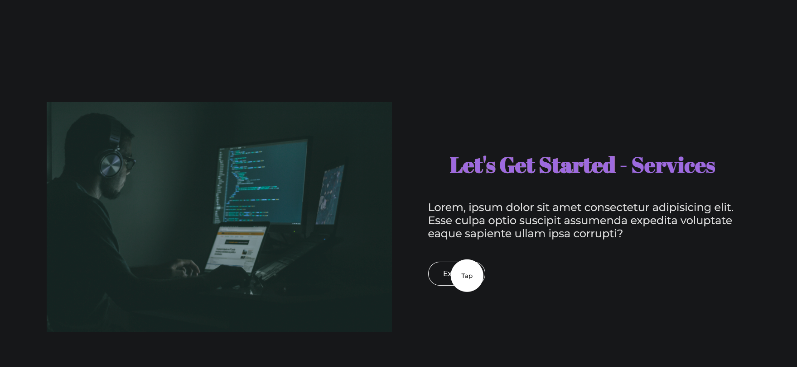

# Portfolio Project 
 
Now that you've had some practice with APIs and have a project to share, you'll be updating your portfolio page and other materials to build toward being employer-competitive.

If you are opting out of career services, this is _still a required assignment_. Part of being a web developer means being a part of a community. Having a place to share your projects is _necessary_ if you're applying for jobs, but it's also _critical_ on your journey as a developer.

# Acceptance Criteria

* Submit an updated portfolio featuring Project 1 and two exemplary homework assignments.

* Submit an updated GitHub profile with pinned repositories featuring Project 1 and two exemplary assignments.

* Submit an updated resume.

* Submit an updated LinkedIn profile.

# Features

## Home Page

Home page that has been setup with siding divs and images that appear to zoom. This functionality runs on page load and when scrolling.

## Scroll Function

As the pages scrolls the divs appear to rise and sliders reveal content.

## Custom Mouse Pointer

Cursor that has a halo effect and changes colour when the user hovers over certain elements.

## Expanding Nav Bar

Navigation bar that expands when selected and nav lines (burger) that change to a cross.

## Text Color Change

When the user hovers on the explore button, the title changes colour.

## Responsive

Responsive design for desktop and mobile.

# Link to Git Hub

https://github.com/mp2626/portfolio_v2    

# link to Site

https://mp2626.github.io/portfolio_v2/    

# Programming Languages
 * HTML 
 * CSS
 * JaveScript
 * Scroll Magic
 * GSAP - Green Sock
 * Google Fonts

# Authors
Contributor - Michael Perrin
Contributor - Dev Ed (online - creative JS course)